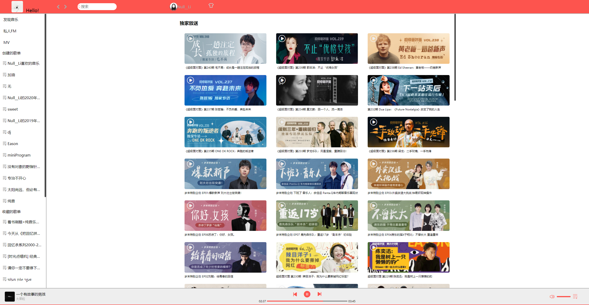
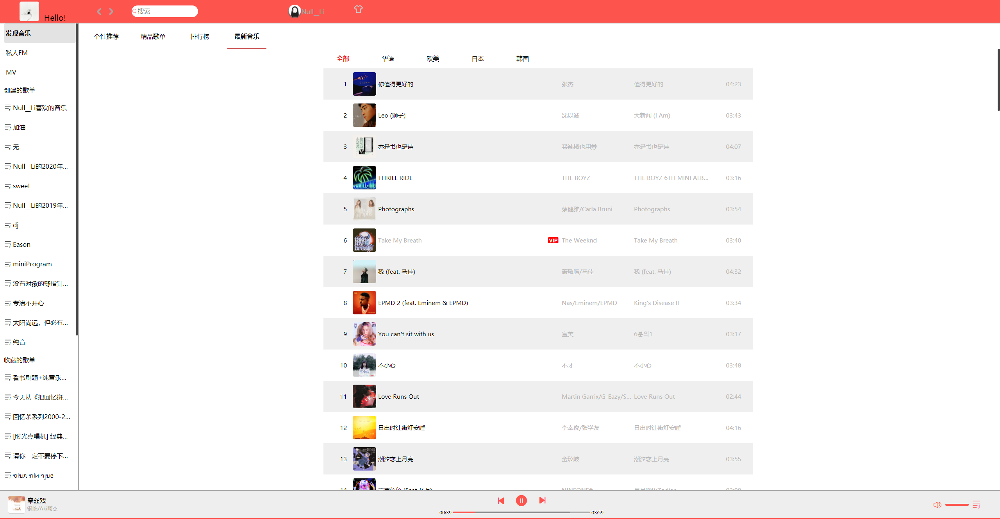

# MusicWebAPP
仿网易云音乐的PC端界面的webApp

### 介绍
项目界面仿照网易云PC端的界面，接口使用[NeteaseCloudMusicApi](https://github.com/Binaryify/NeteaseCloudMusicApi),实现了用户登录，首页推荐歌单，独家放送，最新音乐，推荐MV，精品歌单，搜索歌曲、歌单、视频，获取视频评论以及歌曲评论等功能。

***
其实这个项目有点为了实现功能而实现功能了，并没有什么封装的思想在里面，要问为什么，问就是不会啊，我也想造轮子，不知道怎么造啊。😢有人带我造轮子就更好了。
***

### 技术栈
1. vue2
2. vue router
3. vuex
4. vue cli
5. element-UI
6. better-scroll
7. sass
>项目中，element-ui主要用来做骨架屏以及弹出窗口以及提示信息，无限滚动加载数据，better-scroll 主要用来做了歌词滚动，sass 用来更换主题颜色。（以上的技术栈刚学没多久，运用的程度也很浅，出现了好多的问题以及bug，到现在歌词滚动里还有点小bug，也不知道怎么解决😓）

### 安装环境依赖
```
npm install
```

### 运行
```
npm run serve
```

### 构建打包
```
npm run build
```

### 代码格式化
```
npm run lint
```

### 
**注意**：该项目只用于学习与交流。

### 图片预览
1. 首页未登录


2. 登录界面


3. 首页


4. 独家放送列表


5. 更换主题颜色


6. 精品歌单列表


7. 精品歌单(古风标签)


8. 每日推荐
.png)

9. 排行榜


10. 视频播放界面


11. 搜索单曲


12. 搜索歌单


13. 搜索视频


14. 最新音乐


15. MV列表


16. 音乐播放界面


### 致谢
感谢[NeteaseCloudMusicApi](https://github.com/Binaryify/NeteaseCloudMusicApi)提供的接口地址。